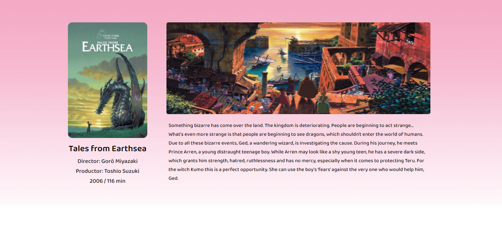

# Ghibli films

Studio Ghibli (スタジオジブリ Sutajio Jiburi?) es un estudio japonés de animación, considerado por la crítica especializada y muchos cinéfilos como uno de los mejores estudios de animación del mundo en la actualidad.1

El estudio es mejor conocido por sus largometrajes animados y también ha producido varios cortometrajes, comerciales de televisión y una película para televisión. Fue fundado el 15 de junio de 1985 por los directores Hayao Miyazaki e Isao Takahata y el productor Toshio Suzuki , después del éxito de la película de anime de Topcraft Nausicaä del Valle del Viento (1984). Studio Ghibli también ha colaborado con estudios de videojuegos en el desarrollo visual de varios videojuegos.

## `Acerca del proyecto`

El proyecto se encuentra desarrollado en React, bajo el ambiente de trabajo generado por `Create React App`. La aplicación lista y permite buscar películas de estudio Ghibli; realiza una consulta al [API](https://ghibliapi.herokuapp.com/#section/Studio-Ghibli-API) de estudio Ghibli para proporcionar la información de cada una de las películas.

## `Mis retos`

La implementación del Hook [useContext] y [useState] de React fue sin duda la parte que mas me agrado del proyecto puesto que me permite acceder a la respuesta del API desde los demás componentes. Y considero que me ayudo a tener una mejor organización de mi código.

Al inicio me costo un poco de trabajo entender cómo funcionaba y como implementar estos Hooks puesto que no tengo mucha experiencia usando React, pero la documentación oficial me ayudó mucho.

## `La arquitectura`

Inicialmente me costó un poco de trabajo decidir la tecnología sobre la que realizaría el proyecto, dado que me entusiasme con esta decisión, las ideas principales eran realizar el proyecto en php, usando Laravel o CodeIgniter; pero al ser estos lenguajes más orientados a la parte del Backend.

Decidí realizar el proyecto en React porque me pareció ser una buena manera de demostrarme a mí mismo los conocimientos que tengo respecto a la librería/framework, además de que el proyecto inicial planteado en el requerimiento no era muy complejo. Mas sin embargo no habría problema si el proyecto en algún momento escalara. 

## `Trade-offs`

Considero que la implementación del proyecto fue sencilla y logre abordar los requerimientos detallados en la solicitud, sin embargo, si tuviera mas tiempo para mejorarla me gustaría darle un poco mas de detalle a la interfaz de usuario, trabajar un poco más en el manejo de errores y presentar más consultas a la API, como por ejemplo el listado de personajes de cada película y re factorizar varias partes del código.

## `Vista al context de mi aplicación`

[https://github.com/HugoTranquilino/ghibli-films/blob/master/src/components/FilmsContext.js](https://github.com/HugoTranquilino/ghibli-films/blob/master/src/components/FilmsContext.js)

## `Link a la aplicación`

[https://hugotranquilino.github.io/ghibli-films/](https://hugotranquilino.github.io/ghibli-films/)

# Getting Started with Create React App

This project was bootstrapped with [Create React App](https://github.com/facebook/create-react-app).

## Available Scripts

In the project directory, you can run:

### `npm start`

Runs the app in the development mode.\
Open [http://localhost:3000](http://localhost:3000) to view it in your browser.

The page will reload when you make changes.\
You may also see any lint errors in the console.

### `npm test`

Launches the test runner in the interactive watch mode.\
See the section about [running tests](https://facebook.github.io/create-react-app/docs/running-tests) for more information.

### `npm run build`

Builds the app for production to the `build` folder.\
It correctly bundles React in production mode and optimizes the build for the best performance.

The build is minified and the filenames include the hashes.\
Your app is ready to be deployed!

See the section about [deployment](https://facebook.github.io/create-react-app/docs/deployment) for more information.

### `npm run eject`

**Note: this is a one-way operation. Once you `eject`, you can't go back!**

If you aren't satisfied with the build tool and configuration choices, you can `eject` at any time. This command will remove the single build dependency from your project.

Instead, it will copy all the configuration files and the transitive dependencies (webpack, Babel, ESLint, etc) right into your project so you have full control over them. All of the commands except `eject` will still work, but they will point to the copied scripts so you can tweak them. At this point you're on your own.

You don't have to ever use `eject`. The curated feature set is suitable for small and middle deployments, and you shouldn't feel obligated to use this feature. However we understand that this tool wouldn't be useful if you couldn't customize it when you are ready for it.

## Learn More

You can learn more in the [Create React App documentation](https://facebook.github.io/create-react-app/docs/getting-started).

To learn React, check out the [React documentation](https://reactjs.org/).

### Code Splitting

This section has moved here: [https://facebook.github.io/create-react-app/docs/code-splitting](https://facebook.github.io/create-react-app/docs/code-splitting)

### Analyzing the Bundle Size

This section has moved here: [https://facebook.github.io/create-react-app/docs/analyzing-the-bundle-size](https://facebook.github.io/create-react-app/docs/analyzing-the-bundle-size)

### Making a Progressive Web App

This section has moved here: [https://facebook.github.io/create-react-app/docs/making-a-progressive-web-app](https://facebook.github.io/create-react-app/docs/making-a-progressive-web-app)

### Advanced Configuration

This section has moved here: [https://facebook.github.io/create-react-app/docs/advanced-configuration](https://facebook.github.io/create-react-app/docs/advanced-configuration)

### Deployment

This section has moved here: [https://facebook.github.io/create-react-app/docs/deployment](https://facebook.github.io/create-react-app/docs/deployment)

### `npm run build` fails to minify

This section has moved here: [https://facebook.github.io/create-react-app/docs/troubleshooting#npm-run-build-fails-to-minify](https://facebook.github.io/create-react-app/docs/troubleshooting#npm-run-build-fails-to-minify)
